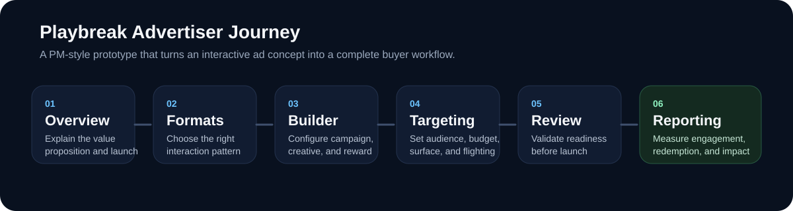

# Prime Video Playbreak Advertiser UI Mockup

A product mockup for the advertiser-side `Playbreak` console on Prime Video.

This repo focuses on the **buyer and operator workflow**: how an interactive ad product would be selected, configured, launched, and measured inside a Prime Video and Amazon Ads context.



## Overview

Playbreak is a concept for a lightweight interactive ad format on Prime Video. This repo shows what the advertiser-side experience might look like if the product were offered through a familiar console workflow.

The mockup covers the full flow:

- overview and value proposition
- format selection
- campaign builder
- targeting and delivery controls
- review and launch
- reporting dashboard

The goal is to move the idea beyond a flashy ad demo and show how it could work as a real ad product.

## Why This Exists

New ad formats often fail for operational reasons, not creative ones.

Even when the concept is strong, buyers still need to understand:

- where the format runs
- what kinds of campaigns it supports
- how creative is configured
- what controls are available
- what metrics prove success

If those pieces are unclear, the product remains a pitch rather than a platform capability.

This mockup addresses that gap by turning the Playbreak concept into a realistic advertiser workflow.

## Product Framing

The console is designed around a simple promise:

**Make Prime Video interactive campaigns feel as easy to buy and manage as a familiar self-serve ad workflow.**

To support that, the mockup emphasizes:

- recognizable Amazon Ads-style setup patterns
- Prime Video-specific surface choices
- structured creative inputs instead of bespoke ops handoffs
- realistic audience, budget, and launch controls
- reporting that connects engagement to downstream outcomes


## What The Mockup Demonstrates

This repo is meant to answer several product questions:

- How should a buyer choose between multiple interactive formats?
- What does a Prime Video pause-ad creative workflow look like?
- How do targeting and delivery controls stay simple without feeling fake?
- What launch-readiness checks matter for a playback-sensitive ad format?
- Which metrics best communicate advertiser value for interactive streaming ads?

## Core Workflow

### 1. Understand the product

The overview page explains the Playbreak value proposition, the speed-to-launch story, and why the format matters for Prime Video.

### 2. Select a format

The buyer chooses between multiple interaction patterns such as:

- `QuickVoice`
- `SpeedPick`
- `RevealIt`

Each format is framed in terms of use case, strengths, and KPI fit.

### 3. Build the creative

The builder lets the advertiser define:

- campaign name
- brand identity
- creative headline
- question and answers
- reward type and value
- brand styling

The screen also includes a pause-ad preview so the format feels concrete.

### 4. Set targeting and delivery

The targeting flow includes:

- audience segments
- geography
- Prime Video surface scope
- flight timing
- pricing model
- total and daily budget

This is where the concept starts to feel operational rather than purely conceptual.

### 5. Review before launch

The review screen summarizes the package, validates readiness, and adds Prime Video-specific safeguards such as playback-safe interaction rules.

### 6. Measure outcomes

The reporting dashboard closes the loop with metrics like:

- pause-ad completion
- viewer engagement
- reward claim rate
- resume-to-content rate
- brand lift
- downstream attributed actions

That measurement layer is what makes the product commercially believable.

## Connection To The Viewer Mockup

This repo is the advertiser-side companion to the viewer experience mockup.

Together, the two repos show both halves of the product:

- the viewer-side interaction inside Prime Video
- the advertiser-side workflow needed to buy, launch, and measure it

That combination is what makes Playbreak useful as a PMT-style case study rather than just a UI concept.

## Who This Is For

This mockup is useful for:

- product managers working on ad formats or monetization
- designers shaping internal tools and media-buying workflows
- engineers scoping platform requirements for interactive ads
- GTM and ads stakeholders who need a concrete artifact to react to
- leadership reviews around Prime Video ad product innovation

## Tech Stack

- Next.js
- React
- TypeScript

## Running Locally

```bash
npm install
npm run dev
```

Then open `http://localhost:3000`.

## Notes

- This is a product mockup, not a production advertising platform.
- Reporting values and campaign data are illustrative.
- The purpose of the repo is to communicate product framing, workflow design, and operational realism rather than backend complexity.
